# ServiceDesk AI

A modern IT Service Desk application powered by AI for automated ticket creation and management. Upload an image of an IT issue and let AI analyze it to create a structured support ticket automatically.

## ✨ Features

- **AI-Powered Ticket Creation** - Upload images of IT issues and let Google Gemini AI analyze them to automatically generate tickets with title, description, and priority
- **IP-Based Geolocation** - Automatically detects user location to suggest the nearest office for ticket assignment
- **Role-Based Access Control** - Three user roles: Admin, Service Desk, and User with different permissions
- **Real-Time Ticket Management** - Track ticket status through the workflow: Open → In Progress → Resolved → Closed
- **Email Reports** - Share ticket details via email directly from the application
- **Dark Mode** - Full dark/light theme support
- **Responsive Design** - Works on desktop and mobile devices

## 📸 Screenshots

### Desktop

| Home Dashboard | Ticket Creation |
|:---:|:---:|
| 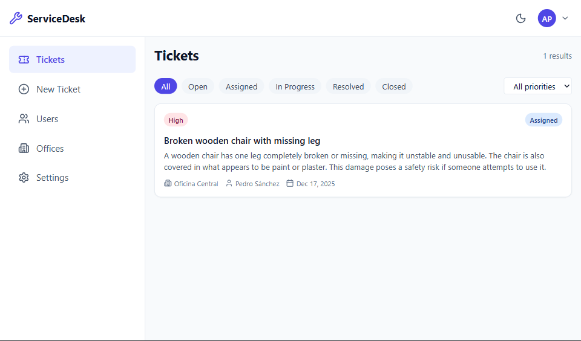 | 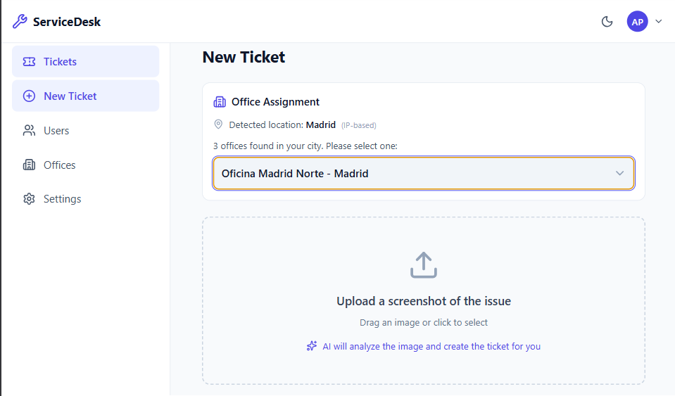 |

| Ticket Details | Office Management |
|:---:|:---:|
| 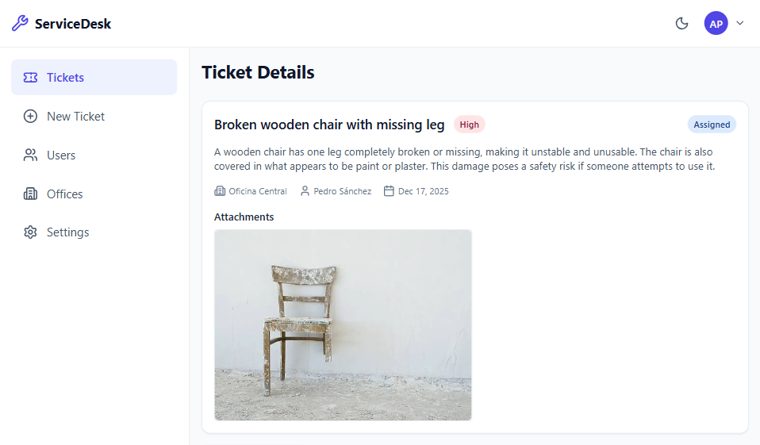 | 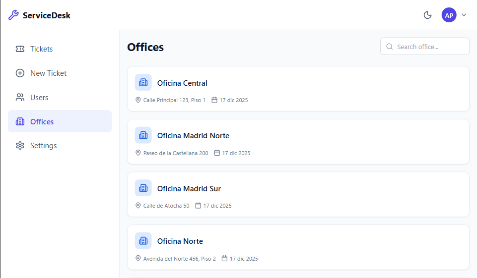 |

| Settings | |
|:---:|:---:|
| 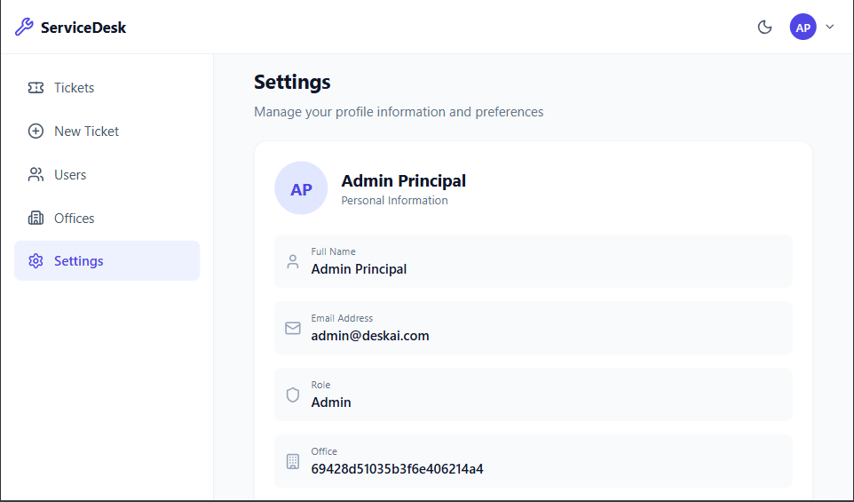 | |

### Mobile

| Login | Home | Ticket Creation |
|:---:|:---:|:---:|
| 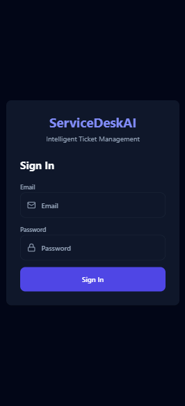 | 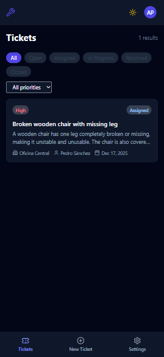 | 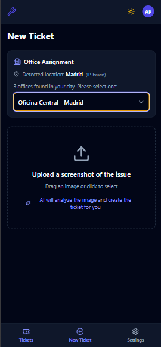 |

| Ticket Details | Office Management | Settings |
|:---:|:---:|:---:|
| 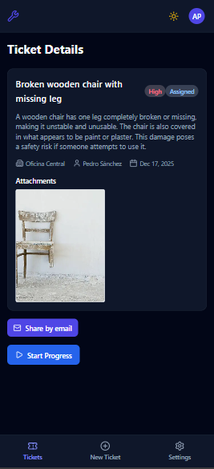 | 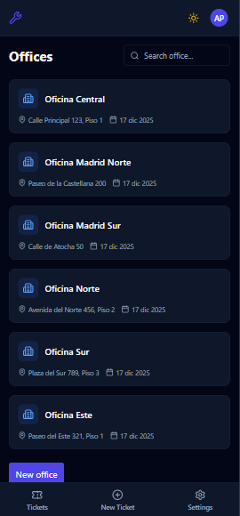 | 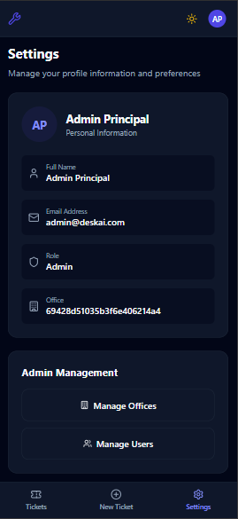 |

## 🛠️ Tech Stack

### Backend
- **Node.js** with **Express 5**
- **TypeScript**
- **MongoDB** with **Mongoose**
- **JWT** for authentication
- **Google Gemini AI** for image analysis
- **Nodemailer** for email functionality
- **Zod** for schema validation

### Frontend
- **React 19** with **TypeScript**
- **Vite** for fast development
- **Redux Toolkit** with **RTK Query** for state management
- **Tailwind CSS** for styling
- **Lucide React** for icons
- **React Router** for navigation
- **React Hot Toast** for notifications

### Infrastructure
- **Docker** & **Docker Compose** for containerization
- **MongoDB 6.0** as database
- **Mongo Express** for database management UI

## 📋 Prerequisites

- Docker and Docker Compose installed
- Google Gemini API key (for AI features)
- SMTP server credentials (for email features)

## 🚀 Installation

### 1. Clone the repository

```bash
git clone https://github.com/FedeDiazDev/ServiceDeskai.git
cd ServiceDeskai
```

### 2. Create environment file

Create a `.env` file in the root directory with the following variables:

```env
# Node Environment
NODE_ENV=development

# Backend
BACKEND_PORT=9000
JWT_SECRET=your_jwt_secret_here

# MongoDB
MONGODB_URI=mongodb://mongodb:27017/servicedesk

# Frontend
VITE_API_BASE_URL=http://localhost:9000/api
FRONTEND_URL=http://localhost:3000

# Google Gemini AI
GEMINI_API_KEY=your_gemini_api_key_here

# SMTP (for email functionality)
SMTP_HOST=smtp.gmail.com
SMTP_PORT=587
SMTP_USER=your_email@gmail.com
SMTP_PASS=your_app_password
```

### 3. Run with Docker Compose

```bash
docker compose up --build
```

This will start:
- **Frontend** at http://localhost:3000
- **Backend** at http://localhost:9000
- **MongoDB** on port 27017
- **Mongo Express** at http://localhost:8081 (admin/admin123)

## 📖 Usage

### Default Users

The application seeds the database with test users on first run:

| Role | Email | Password |
|------|-------|----------|
| Admin | admin@deskai.com | password123 |
| User | juan@deskai.com | password123 |
| User | maria@deskai.com | password123 |
| Service Desk | pedro.service@deskai.com | password123 |
| Service Desk | laura.service@deskai.com | password123 |

### Creating a Ticket

1. Log in with any user account
2. Click on **"New Ticket"** in the navigation
3. The application will detect your location and suggest nearby offices
4. Upload an image of the IT issue
5. The AI will analyze the image and generate ticket details
6. Review and confirm the ticket creation

### Managing Tickets (Service Desk / Admin)

1. View all tickets in the **Tickets** section
2. Click on a ticket to see details
3. Use the action buttons to update status:
   - **Start Progress** - Begin working on the ticket
   - **Mark Resolved** - Mark the issue as resolved
   - **Close Ticket** - Close the ticket after resolution

### Admin Features

- **Users Management** - View and manage all users
- **Offices Management** - Create and manage office locations

## 🏗️ Project Structure

```
ServiceDeskai/
├── backend/
│   └── src/
│       ├── config/         # Database configuration
│       ├── controllers/    # Request handlers
│       ├── middlewares/    # Auth & validation middleware
│       ├── models/         # MongoDB models
│       ├── routes/         # API routes
│       ├── schemas/        # Zod validation schemas
│       ├── services/       # Business logic
│       └── server.ts       # Express app entry point
├── frontend/
│   └── src/
│       ├── components/     # React components
│       ├── config/         # App configuration
│       ├── context/        # React contexts
│       ├── pages/          # Page components
│       ├── routes/         # Route definitions
│       ├── services/       # RTK Query API services
│       ├── store/          # Redux store
│       └── types/          # TypeScript types
├── docker-compose.yml      # Docker orchestration
└── README.md
```

## 🧪 Development

### Running without Docker

**Backend:**
```bash
cd backend
npm install
npm run dev
```

**Frontend:**
```bash
cd frontend
npm install
npm run dev
```

## 📄 License

ISC License

## 👤 Author

Federico Díaz - [GitHub](https://github.com/FedeDiazDev)